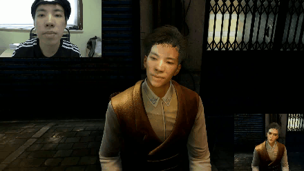

# Faces2one

This is used for generating a new video, given the source video (e.g. avatar actor) and reference video (real actor).

On basis of Yao Feng's work on texture changing, some improvements were made to inhance the performance.
In condition GPU is on, applying rendering in C++, and without much remarkable time consuming method in cv, 
the process speed on single frame varies, depending mainly on face detection (~70%, dlib utilized currently), 
cropping (~15%), etc. making it around 1.0 FPS on average, with GeForce GTX 1060.

When face dection fails, it may due to environment light, head orientation, occlusion or camera distance.
In failing cases, try turning on the exposure adjustment. It would take extra ~400ms on every frame though. 
If the exposure doesn't settle it down, it should go to the worst situation, needing for further polishing.

Still great potential for acceleration.


### Usage

Download the trained model at [BaiduDrive](https://pan.baidu.com/s/10vuV7m00OHLcsihaC-Adsw) or [GoogleDrive](https://drive.google.com/file/d/1UoE-XuW1SDLUjZmJPkIZ1MLxvQFgmTFH/view?usp=sharing), and put it into `Data/net-data`

To run the code:

   `python faces2one_gpu.py -s videos/source_video.avi -r videos/reference_video.avi -o videos/new_video.avi`


### To be improved

* #### Unstable on texture
  
  
* #### Texture deformation from different expression


## Update

* 2019/10/22 add smooth function on vertices.

* 2019/11/06 modify the consistence of 3 channels of mask.

* 2019/11/07 compatible with smooth in "storyboard".

* 2019/11/12 improve the texture deformation.


## Demonstration

<p align="center"> 

</p>


## Citation

If you use this code, please consider citing:

```
@inProceedings{feng2018prn,
  title     = {Joint 3D Face Reconstruction and Dense Alignment with Position Map Regression Network},
  author    = {Yao Feng and Fan Wu and Xiaohu Shao and Yanfeng Wang and Xi Zhou},
  booktitle = {ECCV},
  year      = {2018}
}
```


## Acknowledgements

- Thanks [YadiraF](https://github.com/YadiraF/PRNet) for the idea of rendering and contributions on speed-up methods in C.
